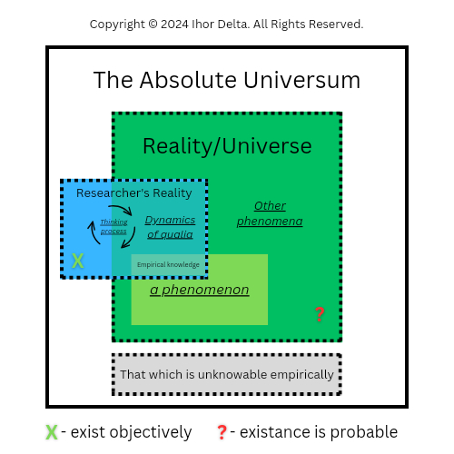

_Copyright © 2024 Ihor Delta. All Rights Reserved._

**Important**: It's a fiction. No warranties. 

This project is about a concept of "externality", relatively to a researcher's reality, space with no spacetime limits and as follows no our physical world limits. It's a product of thinking in philosophical manner made by Ihor Delta. Can be used as ontological theory for explaining of how it is. Base idea created following the principle of doubt of René Descartes and do not violate his conclusion of assurance of presence only subjective reality of researcher for sure so as this "externality" relation is flexible (possible to be a frame for subjective reality defining its boundaries), and its position, relatively to researcher, depends on the theoretical ideology of one.

# The Absolute Universum

This article is about a concept of _The Absolute Universum_, that proposes a new point of view on our reality, _Universe_, being (see **[Links](#links)**). It is knowable through a set of facts/narratives about it (see **[Fact Map](#fact-map)**).

***The meaning of the word universum should be understood as “the totality of everything” in the context of this article.**

# Manifest

Further I will use word "Universum" to mark _The Absolute Universum_ object. Also, I will use word "researcher" to mark a subject, subjective reality; I will use the plural in relation to subjective reality conditionally and in parentheses, based on the assumption that in addition to the subjective reality of the researcher of this article, there are other subjective realities of other individuals (see my [Cogito ergo sum](https://telegra.ph/Cogito-ergo-sum-05-17) article).

We do not use verb "exist" for this so as everything, literally, exist "inside" ``Universum``. Word "exist" can't be applied for representing presence of ``Universum``, instead verb "is" can be used as most suitable verb in English, so as "existance" is a characteristics of objects inside ``Universum``. So we talk about presence of ``Universum`` rather than its existance.

> "The Absolute Universum is present." - axiom

It presupposes the presence of an environment that is "external" to the researcher, at the same time it can be a part of researcher's subjective world if assumption about existance of objective word is false. 

Following the concept of _The Absolute Universum_, our spacetime based material universum (_Universe_) is only one of the possible universums existing "inside" ``Universum``.

Has a characteristic of limitlessness above like spacetime limits, so according to this characteristic can include subjective reality(ies) of researcher(s).

I daresay that some researchers may find this concept similar to the concept of _God_.  Based on the anthropomorphism of the concept of God, it is not entirely suitable; the concept of the supernatural as a phenomenon, the study of which involves mental going beyond the boundaries of our universum - our _Universe_, is better suited here, and it is only appropriate if you simply want to associate a given concept with some more familiar concept.

Below, I present you a fact map that describes Universum for it to become knowable for you. 

# Fact Map

***Fact map implies additions as I reflect and collect facts about ``Universum``.**

*The word "inside" is used in a figurative sense, for ease of imagination.

- "our" reality that we call objective reality, so as subjective reality(ies) and other possible realities, exist "inside" ``Universum``. 

- ``Universum`` contains literally everything.

- contains our spacetime universum (our reality) and everything that is aside of it (assumption).

- imaginable as "space" for everything. 

- not limited of spacetime basement/nature. 

- those, "inside" of what, existance is possible (see thesis of Manifest about presence of ``Universum``).

- has characteristic of limitlessness above spacetime limits. 

- ``Universum`` includes all objects that cannot be known empirically. 

- its nature is not physical, in the sense of possessing its own laws and including at least one material universum (e.g. _Universe_). 

- is a whole that is speculatively divisible into parts, but is not part of something as a whole. 

- not represented within the limits/borders that can be imagined.

- "existance" is a characteristic that is applied to objects "inside" Universum, when verb "exist" is not applicable to ``Universum`` itself.

- borders of objects "inside" of Universum is where we personally define them (relativity). 

- objects "inside" Universum exist relatively to each other.

- researcher explore Universum using the qualia that arise dynamically in the process of thinking (see **[Assumption of Researcher-Reality Relations](#assumption-of-researcher-reality-relations)** image).

- the presence of ``Universum`` presupposes the presence of an "externality" in relation to the researcher (including his thinking process and qualia dynamics).

- precence of ``Universum`` presupposes the presence of an "environment" that is "external" to the researcher.

- because  the existence of an observable reality is just an assumption, then ``Universum`` can determine the boundaries of the researcher’s reality.

- the boundaries of objects within ``Universum`` are speculative.  We can say that “inside” everything is interconnected.

- knowable intuitively, not empirically.

## Assumption of Researcher-Reality Relations

This assumption presupposes the process of emergence of empirical knowledge, and the thought process over the dynamics of qualia, which arose as a result of the empiricism of the researcher’s reality in relation to possible existing objective reality.

# Links
**_i_**. [Универсум / Wikipedia](https://ru.m.wikipedia.org/wiki/%D0%A3%D0%BD%D0%B8%D0%B2%D0%B5%D1%80%D1%81%D1%83%D0%BC) (ru)

**_ii_**. [Reality / Wikipedia](https://en.m.wikipedia.org/wiki/Reality)

**_iii_**. [Cogito ergo sum / Telegraph, Ihor Delta](https://telegra.ph/Cogito-ergo-sum-05-17)
